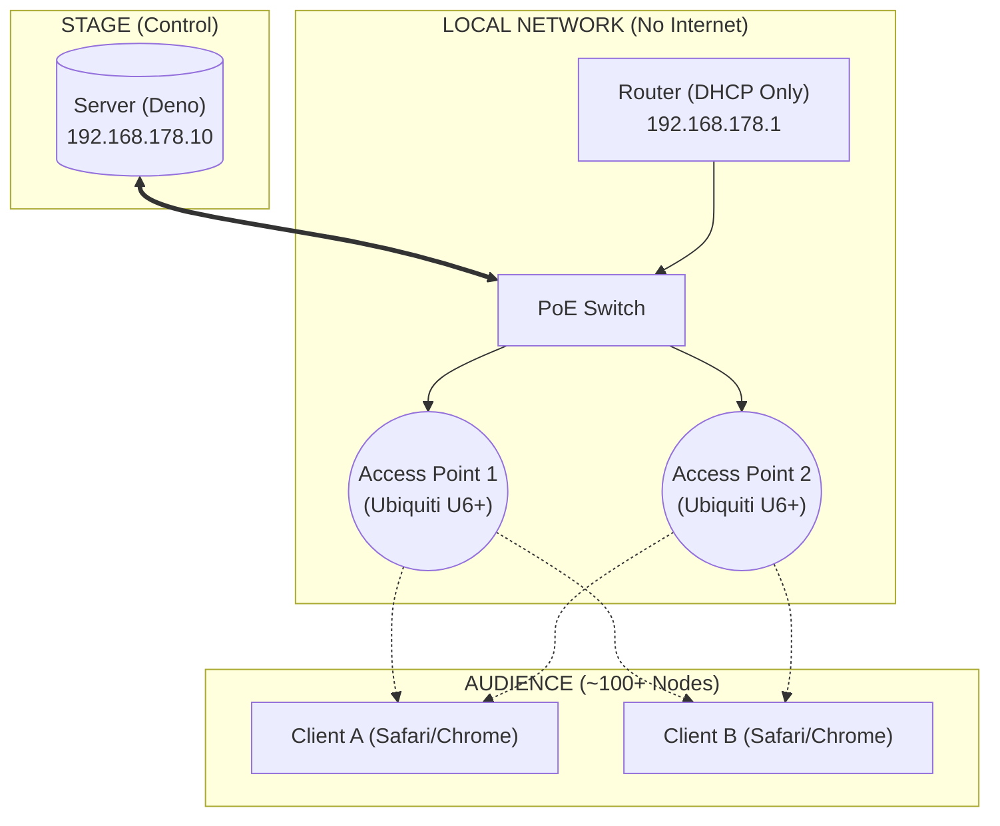

# local.assembly.fm
http://localhost stack for distributed synthesis

Here is a structured, professional README.md designed for your GitHub repo. It captures the technical depth ("Deno", "WebAudio") while explaining the physical setup, which is crucial for this specific project.

I have included the Mermaid diagram we discussed, as GitHub renders these natively now.

---

# Distributed Synthesis

**A co-located networked music instrument utilizing audience smartphones as distributed synthesizer voices.**


## 📖 Overview

**Distributed Synthesis** is a system for live performance that turns a crowd of people into a polyphonic digital music instrument.

Instead of broadcasting audio *to* the audience, the audio is generated *by* the audience. A central server broadcasts rhythm, pitch, and timbre data via WebSockets to connected smartphones. The phones synthesize the audio locally using the Web Audio API, creating a textural sound field capable of expressing multi-channel sonic works.

Designed for high-density, offline environments (venues, galleries) where internet connectivity is unreliable or undesirable.


## 🏗 Architecture

The system uses a "V-Shape" topology to minimize latency. The Router handles DHCP, but high-frequency musical data flows strictly between the Server and Access Points.



## ⚡ Features

* **Low-Latency Sync:** Implements a custom NTP-style handshake to synchronize the `AudioContext` clock of 100+ devices to a central server time (typically <10ms variance).
* **Distributed Audio Engine:** All DSP (synthesis) happens on the client side to save bandwidth. The server only sends lightweight control messages (JSON).
* **Captive Portal Evasion:** Designed to bypass "Captive Network Assistants" (CNA) to ensure full WebAudio access in the main browser.
* **Offline-First:** Runs entirely on a local LAN; no ISP required.


## Prerequisites

* **Runtime:** [Deno 2](https://deno.land/) (tested with v2.7.1)
* **Hardware:**
  * Intel NUC (or similar) as server
  * Netgear GS305PP PoE switch
  * 2x Ubiquiti U6+ access points
  * FritzBox 7490 (DHCP only)


## Getting Started

### Development (localhost)

```bash
deno task dev
```

Opens `https://localhost:8443`. Self-signed TLS certs auto-generate on first run.

### Network Setup (performance LAN)

The server runs on an isolated local network — no internet required.

```
NUC (server)                    Phones
192.168.178.10 ──→ GS305PP ──→ U6+ APs ···WiFi "assembly"···→ audience
                      │
                   FritzBox
                   192.168.178.1 (DHCP)
```

**Bring up the NUC ethernet** (required after every boot or cable change due to igc driver bug):
```bash
sudo modprobe -r igc && sudo modprobe igc
sudo ip addr add 192.168.178.10/24 dev enp86s0
sudo ip link set enp86s0 up
```

**Start the server:**
```bash
deno task dev
```

**Connect phones:**
1. Join WiFi SSID `assembly`
2. Disable cellular data (or use airplane mode + WiFi) — otherwise the phone routes traffic over cellular
3. Open `https://192.168.178.10:8443` and accept the cert warning

### AP Adoption (one-time setup)

The U6+ APs need to be adopted via a UniFi controller. A temporary Docker setup is in `unifi/`:

```bash
cd unifi && sudo docker compose up -d
```

Open `https://localhost:8443`, adopt the APs, create WiFi network "assembly". Then shut it down — APs retain their config:

```bash
sudo docker compose down
```


## 🎵 Performance Control

monome grid 128 + monome arc 4


## ⚠️ Troubleshooting

**Latency / Jitter issues:**

* Ensure the Server is wired via **Ethernet**, not WiFi.
* Check if clients are in "Low Power Mode" (iOS throttles JS timers).
* Verify the router is not overwhelmed (use dedicated APs for >30 users).
* Remember to manage Screen Wake Lock API.

**Audio not starting:**

* Ensure the user has interacted with the page (click/tap) to resume the `AudioContext`.
* Check if the device is stuck in a "Captive Portal" browser (CNA). If so, tell them to open the URL in Safari/Chrome manually.

## 📄 License

GNU something