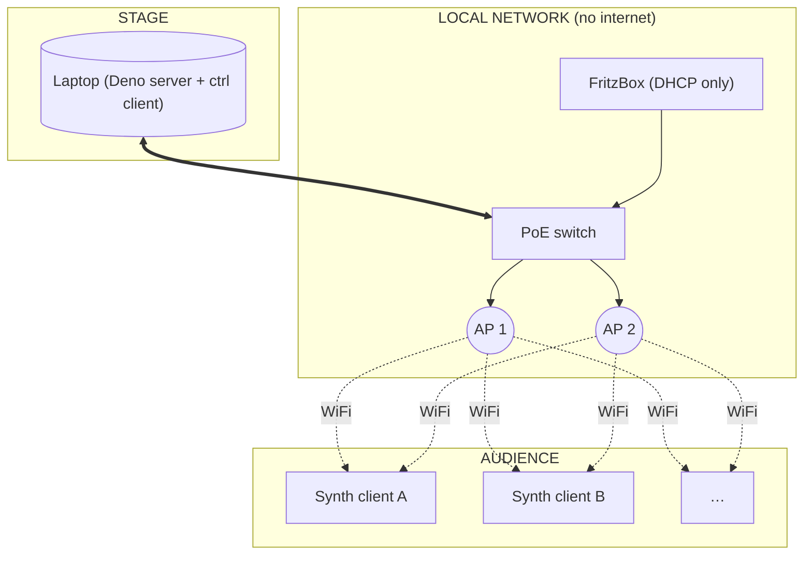

# local.assembly.fm

A networked instrument for live performance. The audience joins a local WiFi, opens a captive portal, and their phones become voices of a distributed synthesiser. The performer plays it from a laptop on the same network.

This is a personal instrument under active development — built by and for one performer, used in live shows. Not a product, not a framework. Expect rough edges and breaking changes.


## What it is

- A Deno HTTPS server running on a laptop, on a local network with no internet.
- A patch editor (`ctrl` client) in the browser on that laptop, where patches are built from small typed boxes connected by cables — a visual dataflow language called GPI.
- A synth client that runs in any modern mobile browser. The audience visits a URL, taps a button, and their phone starts rendering audio with the Web Audio API.
- A captive portal that pops the synth client open automatically when phones join the WiFi.
- Hardware control surfaces: Monome Grid/Arc, MIDI keyboards, BBC2 breath/bite/head controller — all hot-pluggable.


## What it isn't

- **There is no inter-client clock sync.** Phones render on their own AudioContext clocks. The server sends control messages; each phone applies them when they arrive. Timing drift between phones is part of the sound, not a bug to fix.
- **It does not work over the public internet.** The whole point is a local-only LAN: ~100 phones, two access points, no ISP. Round-trip latency on a local 5 GHz network is small enough that control feels immediate.
- **It is not a multi-user editor.** One performer, one ctrl client, one patch at a time.


## Architecture



**Server** (`server.ts`, `eval-engine.ts`, `patch-state.ts`, `hardware.ts`) holds the canonical patch, evaluates ctrl-zone boxes, and broadcasts state to clients.

**Ctrl client** (`public/ctrl.*`) is the patch editor and live performance surface on the laptop. It has an AudioContext too — ctrl-zone audio objects (e.g. ctrl-side reverb, scope, monitor) run here, so the laptop can drive the PA.

**Synth clients** (`public/main.js`, `public/processor.js`, and the many `*-processor.js` AudioWorklets) run on audience phones. Each phone instantiates its own copy of the synth-side graph and renders audio locally.

**Transport.** WebSocket is the primary channel. An SSE fallback exists because older iOS Captive Network Assistant browsers don't support WebSocket — without it, those phones can't play. Both flow through the same broadcast pipeline.


## The patch language: GPI

Patches are graphs of typed boxes joined by cables. Each box has inlets, outlets, and a zone.

- **ctrl zone** runs on the server. Sources (`breath`, `bite`, `key`, `arc`, `cc`, `grid-*`), event generators (`metro`, `delay`), value-on-trigger boxes (`sig`, `sequence`, `counter`, `drunk`, `spread`), reactive math (`+`, `-`, `*`, `/`, `scale`, `clip`, `mtof`, `quantize`, `pow`, `sample-hold`, `gate`).
- **synth zone** runs on clients. Envelopes (`adsr`, `ar`, `ramp`), smoothers (`slew`, `lag`, `inertia`, `follow`), oscillators (`phasor`, `sine`, `tri`), engines (`formant~`, `ks~`, `swarm~`, `chaos~`, `cosine~`, `sigmoid~`, `frog~`, `ewing~`, `noise~`, `cute-sine~`), effects (`conv~`).
- **router zone** sits on the border between ctrl and synth: `all`, `one`, `sweep`, `fraction`, plus voice-allocation routers like `assign`.

### The border rule

The patch canvas has a horizontal **synth border**. Above it = the ctrl side (one laptop). Below it = the synth side (N phones). Synth-zone boxes can be on either side, but **they cannot cross the border** — an `adsr` above the border drives a ctrl-side engine; an `adsr` below the border drives a synth-side engine. The border means "one instance vs many", not "no audio above".

Routers carry **events** (onsets, ticks, gates) and **instant values** (a SIG output, a math result) across the border. They never carry continuous interpolation, because that would mean shipping a sample stream over WebSocket. Smoothing happens locally on whichever side the engine lives.

### Two-phase propagation

When a cable updates, values arrive at all relevant inlets *before* any trigger fires. This means the right-to-left ordering convention from Pure Data isn't necessary — cables can be drawn in any order and behaviour is deterministic. See the snapshot tests under `tests/`.

### Box reference

There are ~120 box types. The patch editor shows inline help (`?` next to the box name in tooltips) sourced from `public/gpi-types.js`. That file is the canonical reference.


## Hardware control surfaces

- **Monome Grid 128** — `grid-trig`, `grid-toggle`, `grid-array` boxes map screen regions to grid regions with LED feedback.
- **Monome Arc 4** — `arc` box, continuous rotary input with LED ring feedback.
- **MIDI** — `key` (note), `cc` (control change, one outlet per CC number), `pad` (note-on filter / event router).
- **BBC2** — `breath`, `bite`, `nod`, `tilt` (CC1/CC2/CC12/CC13 with named outlets).

All four are hot-pluggable. Connect/disconnect is detected via serialosc (Monome) and the Web MIDI API; the status bar reflects current state.


## Running it

### Prerequisites

- Deno 2 (`brew install deno`)
- dnsmasq (`brew install dnsmasq`) — only needed for the captive portal flow on a real LAN
- certbot (`brew install certbot`) — for Let's Encrypt cert renewal
- A TLS cert (`cert.pem`, `key.pem`) in the project root. Either Let's Encrypt for `local.assembly.fm`, or a self-signed cert for localhost.

### Localhost (patch editing, no audience)

```bash
deno task dev
```

Opens `https://localhost:8443`. Open the synth client in another browser tab to test patches without setting up the network.

### Performance LAN (macOS)

`start-macos.sh` handles the full bringup — sets the static IP, configures dnsmasq to resolve `local.assembly.fm` to the laptop, and launches the server.

```bash
./start-macos.sh           # dnsmasq + server
./start-macos.sh dev       # same, with auto-reload
./start-macos.sh local     # patch-editing only, no DNS or subnet check
./start-macos.sh status    # check what's running
```

The server must bind ports 80 and 443 directly (pfctl forwarding is unreliable on macOS), so it needs `sudo`. The script enforces the laptop's IP is `192.168.178.24` — this has to match the DNS server entry the FritzBox hands out via DHCP.

### Self-signed cert (dev only)

```bash
openssl req -x509 -newkey rsa:2048 -nodes \
  -keyout key.pem -out cert.pem -days 365 \
  -subj "/CN=local.assembly.fm" \
  -addext "subjectAltName=DNS:local.assembly.fm,DNS:localhost,IP:127.0.0.1"
```

The `-addext` flag is required — Deno's TLS stack rejects X.509 v1 certs (`UnsupportedCertVersion`), and any extension forces v3.

Browsers will show a one-time security warning. For real performances, use a Let's Encrypt cert (DNS-01 challenge — see the existing notes in `dev_log.md`).


## Hardware rig

- M2 MacBook Pro (server + ctrl client + PA output)
- 1× FritzBox (DHCP and gateway; no internet uplink needed)
- 1× small Ethernet switch (PoE if powering the APs over the cable)
- 2× WiFi access points (Ubiquiti U6+ in current rig, adopted once via a temporary UniFi controller in `unifi/`)
- Hardware controllers as needed: Monome Grid 128, Monome Arc 4, MIDI keyboard, BBC2

The captive portal redirect, TLS, and DNS setup are tuned to this specific rig. Treat it as the reference topology — localhost dev works, but the real instrument needs the LAN to behave a certain way.


## Status

Active prototyping. The patch language, box set, and internal protocols change without notice. Save patches frequently and expect to port them across versions by hand. The `patches/` directory holds the most recent working performance patches (`epimetheus.json`, `frogs.json`, `ks_arp.json`); `patches/archive/` is the boneyard.


## License

GPLv3. See `LICENSE`.
