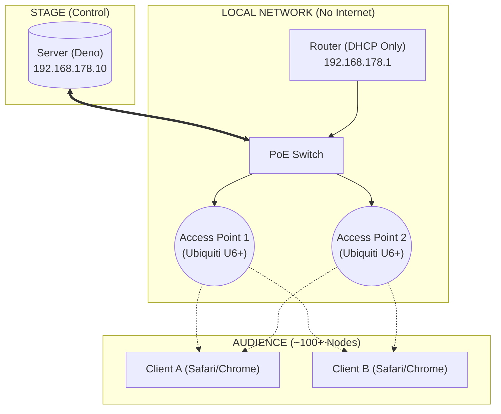

# local.assembly.fm
http://localhost stack for distributed synthesis

Here is a structured, professional README.md designed for your GitHub repo. It captures the technical depth ("Deno", "WebAudio") while explaining the physical setup, which is crucial for this specific project.

I have included the Mermaid diagram we discussed, as GitHub renders these natively now.

---

# Distributed Synthesis

**A co-located networked music instrument utilizing audience smartphones as distributed synthesizer voices.**


## 📖 Overview

**Distributed Synthesis** is a system for live performance that turns a crowd of people into a polyphonic digital music instrument.

Instead of broadcasting audio *to* the audience, the audio is generated *by* the audience. A central server broadcasts rhythm, pitch, and timbre data via WebSockets to connected smartphones. The phones synthesize the audio locally using the Web Audio API, creating a textural sound field capable of expressing multi-channel sonic works.

Designed for high-density, offline environments (venues, galleries) where internet connectivity is unreliable or undesirable.


## 🏗 Architecture

The system uses a "V-Shape" topology to minimize latency. The Router handles DHCP, but high-frequency musical data flows strictly between the Server and Access Points.



## ⚡ Features

* **Low-Latency Sync:** Implements a custom NTP-style handshake to synchronize the `AudioContext` clock of 100+ devices to a central server time (typically <10ms variance).
* **Distributed Audio Engine:** All DSP (synthesis) happens on the client side to save bandwidth. The server only sends lightweight control messages (JSON).
* **Captive Portal:** Phones joining the WiFi land on a portal page automatically; tapping "ENTER" opens the synth client in the real browser.
* **Offline-First:** Runs entirely on a local LAN; no ISP required.


## Prerequisites

* **Runtime:** [Deno 2](https://deno.land/) (tested with v2.7.1)
* **Hardware:**
  * Intel NUC (or similar) as server
  * Netgear GS305PP PoE switch
  * 2x Ubiquiti U6+ access points
  * FritzBox 7490 (DHCP only)


## Getting Started

### Development (localhost)

```bash
deno task dev
```

Opens `https://localhost:8443`.

### Network Setup (performance LAN)

The server runs on an isolated local network — no internet required.

```
NUC (server)                    Phones
192.168.178.10 ──→ GS305PP ──→ U6+ APs ···WiFi "assembly"···→ audience
                      │
                   FritzBox
                   192.168.178.1 (DHCP, DNS → .10)
```

**Bring up the NUC ethernet** (required after every boot or cable change due to igc driver bug):
```bash
sudo modprobe -r igc && sudo modprobe igc
sudo ip addr add 192.168.178.10/24 dev enp86s0
sudo ip link set enp86s0 up
```

**Start dnsmasq** (resolves all DNS to server IP for captive portal + TLS):
```bash
sudo dnsmasq --bind-interfaces --conf-file=/etc/dnsmasq.d/assembly.conf
```

**Port redirects** (captive portal + HTTPS without port number):
```bash
sudo iptables -t nat -A PREROUTING -i enp86s0 -p tcp --dport 80 -j REDIRECT --to-port 8080
sudo iptables -t nat -A PREROUTING -i enp86s0 -p tcp --dport 443 -j REDIRECT --to-port 8443
```

**Start the server:**
```bash
deno task dev
```

**Connect phones:**
1. Put phone in airplane mode, turn WiFi back on
2. Join WiFi SSID `assembly`
3. Captive portal appears automatically → tap "TAP TO START" → audio begins
4. Fallback: open browser, type `local.assembly.fm`

### macOS Setup (M2 MacBook Pro)

**Alternative deployment on macOS** (tested on M2 2022 MBP). Key differences: no iptables (use direct ports), dnsmasq via Homebrew, Docker networking limitations.

**Network Topology:**
```
Mac (192.168.178.24, USB ethernet en5)
  ↓
GS305PP PoE Switch
  ├─ FritzBox (192.168.178.1) — DHCP + gateway
  ├─ U6+ AP #1 (192.168.178.20)
  └─ U6+ AP #2 (192.168.178.21)
```

**Prerequisites:**
```bash
# Install dependencies
brew install certbot dnsmasq

# Generate Let's Encrypt certificate
sudo certbot certonly --manual --preferred-challenges dns -d local.assembly.fm
# Follow prompts to add TXT record to Namecheap DNS

# Copy certificates
sudo cp /etc/letsencrypt/live/local.assembly.fm/fullchain.pem cert.pem
sudo cp /etc/letsencrypt/live/local.assembly.fm/privkey.pem key.pem
sudo chown $(whoami) cert.pem key.pem
```

**Configure DNS (dnsmasq):**
```bash
# Create config
echo "interface=en5
address=/#/192.168.178.24" | sudo tee /opt/homebrew/etc/dnsmasq.d/assembly.conf

# Configure FritzBox to hand out Mac IP as DNS:
# 1. Open http://192.168.178.1
# 2. Navigate to DNS settings (in Network or DHCP section)
# 3. Set DNS server to: 192.168.178.24
```

**Adopt U6+ APs (if not already configured):**
```bash
# 1. Start UniFi controller
cd unifi && docker compose up -d

# 2. Factory reset APs (press reset button 10-15 seconds)

# 3. SSH into each AP and set inform URL
ssh ubnt@192.168.178.20  # password: ubnt
set-inform http://192.168.178.24:8080/inform
exit

ssh ubnt@192.168.178.21
set-inform http://192.168.178.24:8080/inform
exit

# 4. Open https://localhost:8443
# 5. Complete setup wizard (skip cloud, create local admin)
# 6. Adopt both APs in Devices section
# 7. Create WiFi: Settings → WiFi Networks → Create New
#    - Type: Standard
#    - Name: assembly
#    - Password: assembly

# 8. Stop controller (APs retain config)
docker compose down
```

**Run System (requires 2 terminal windows):**

Terminal 1 — DNS:
```bash
sudo /opt/homebrew/opt/dnsmasq/sbin/dnsmasq \
  --keep-in-foreground \
  --bind-interfaces \
  --conf-file=/opt/homebrew/etc/dnsmasq.d/assembly.conf
```

Terminal 2 — Server (ports 80/443):
```bash
cd /Users/capo_greco/Documents/local.assembly.fm
sudo HOST_IP=192.168.178.24 deno task start
```

**Test:**
- Connect phone to "assembly" WiFi (password: `assembly`)
- Captive portal should auto-appear, or visit any URL to trigger redirect
- Tap "TAP TO START" to begin audio synthesis

**Important Notes:**
- **Server must run on ports 80/443** (pfctl port forwarding unreliable on macOS)
- **Requires sudo** for both dnsmasq and server (privileged ports)
- **Keep terminals open** during performance (or use screen/tmux)
- **Mac IP must be 192.168.178.24** (configure static IP if DHCP changes)
- See `dev_log.md` for full troubleshooting details

### TLS Certificates (Let's Encrypt)

Uses a real CA-signed cert for `local.assembly.fm` — no browser warnings. dnsmasq resolves the domain to `192.168.178.10` on the LAN.

**Renew** (every 90 days, needs internet):
```bash
sudo certbot certonly --manual --preferred-challenges dns -d local.assembly.fm
# Add the TXT record _acme-challenge.local in Namecheap Advanced DNS
# Then copy certs:
sudo cp /etc/letsencrypt/live/local.assembly.fm/fullchain.pem cert.pem
sudo cp /etc/letsencrypt/live/local.assembly.fm/privkey.pem key.pem
sudo chown $(whoami) cert.pem key.pem
```

Current cert expires: **2026-05-30**

### AP Adoption (one-time setup)

The U6+ APs need to be adopted via a UniFi controller. A temporary Docker setup is in `unifi/`:

```bash
cd unifi && sudo docker compose up -d
```

Open `https://localhost:8443`, adopt the APs, create WiFi network "assembly". Then shut it down — APs retain their config:

```bash
sudo docker compose down
```


## 🎵 Performance Control

The system supports monome grid 128 and monome arc 4 controllers for live parameter control.

### Monome Grid Integration

Three grid box types are available in the patch editor (ctrl zone):

**grid-trig** — Momentary trigger region
```
grid-trig x y w h
```
Outputs `1` when any button in the region is pressed, `0` when released. Entire region lights up while pressed.

**grid-toggle** — Latching toggle region
```
grid-toggle x y w h
```
Each press flips the state between `0` and `1`. LED feedback shows current state (off = 0, full brightness = 1).

**grid-array** — Integer array with range gestures
```
grid-array x y w h
```
Outputs a 1-indexed array of integers. Supports sophisticated range selection:

- **Single press:** Toggle value in/out of array (button x=0 → value 1, x=1 → value 2, etc.)
- **Hold + press:** Fill or clear range (inclusive endpoints)
  - Hold **inactive** button → press second button → **fill range**
  - Hold **active** button → press second button → **clear range**
- LED brightness indicates state (dim = in array, off = not in array)

Example: In a region at (0, 0) with width 12:
- Press x=2 → outputs `[3]`
- Press x=5 → outputs `[3, 6]`
- Hold x=2, press x=5 → outputs `[3, 4, 5, 6]` (range fill)
- Hold x=3 (active), press x=5 → outputs `[6]` (range clear)

**Hot-plug detection:** Grid connection/disconnection is automatically detected and displayed in the status bar.

### Monome Arc Integration

The monome arc 4 is a continuous rotary encoder controller with LED ring feedback. Arc support uses serialosc (same as grid) for reliable cross-platform communication.

**arc** — Continuous rotation encoder
```
arc i m
```
Where:
- `i` = encoder index (0-3 for arc 4)
- `m` = mode (currently only 0 supported: continuous rotation, outputs 0-1)

**Behavior:**
- Turning clockwise increases the value toward 1
- Turning counter-clockwise decreases the value toward 0
- Values clamp at boundaries (no wrapping)
- Fine-grained control (sensitivity: 0.0003)

**LED feedback:**
- 64-LED ring per encoder
- Visual indicator starts at 6 o'clock (bottom), fills clockwise
- Brightness scales with value (0 = all off, 0.5 = half ring, 1 = full ring)

**Hot-plug detection:** Arc connection/disconnection is automatically detected and displayed in the status bar with device type and ID.

**Requirements:**
- serialosc must be running (`brew services start serialosc` on macOS)
- Arc devices are automatically detected on connection
- Supports both grid and arc connected simultaneously

Example: Control a synth parameter with encoder 0:
```
arc 0 0  →  smooth cutoff
```


## ⚠️ Troubleshooting

**Latency / Jitter issues:**

* Ensure the Server is wired via **Ethernet**, not WiFi.
* Check if clients are in "Low Power Mode" (iOS throttles JS timers).
* Verify the router is not overwhelmed (use dedicated APs for >30 users).
* Remember to manage Screen Wake Lock API.

**Audio not starting:**

* Ensure the user has interacted with the page (click/tap) to resume the `AudioContext`.
* Check if the device is stuck in a "Captive Portal" browser (CNA). If so, tell them to open the URL in Safari/Chrome manually.

## 📄 License

GNU something