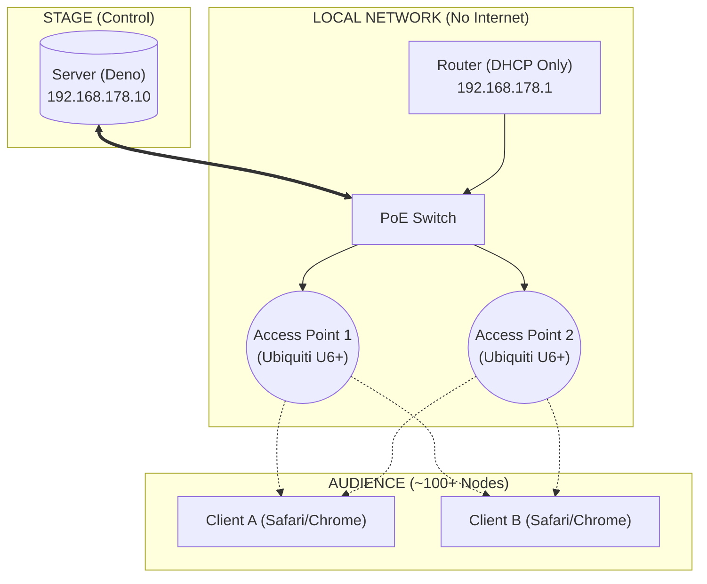

# local.assembly.fm
http://localhost stack for distributed synthesis

Here is a structured, professional README.md designed for your GitHub repo. It captures the technical depth ("Deno", "WebAudio") while explaining the physical setup, which is crucial for this specific project.

I have included the Mermaid diagram we discussed, as GitHub renders these natively now.

---

# Distributed Synthesis

**A co-located networked music instrument utilizing audience smartphones as distributed synthesizer voices.**


## 📖 Overview

**Distributed Synthesis** is a system for live performance that turns a crowd of people into a polyphonic digital music instrument.

Instead of broadcasting audio *to* the audience, the audio is generated *by* the audience. A central server broadcasts rhythm, pitch, and timbre data via WebSockets to connected smartphones. The phones synthesize the audio locally using the Web Audio API, creating a textural sound field capable of expressing multi-channel sonic works.

Designed for high-density, offline environments (venues, galleries) where internet connectivity is unreliable or undesirable.


## 🏗 Architecture

The system uses a "V-Shape" topology to minimize latency. The Router handles DHCP, but high-frequency musical data flows strictly between the Server and Access Points.



## ⚡ Features

* **Low-Latency Sync:** Implements a custom NTP-style handshake to synchronize the `AudioContext` clock of 100+ devices to a central server time (typically <10ms variance).
* **Distributed Audio Engine:** All DSP (synthesis) happens on the client side to save bandwidth. The server only sends lightweight control messages (JSON).
* **Captive Portal Evasion:** Designed to bypass "Captive Network Assistants" (CNA) to ensure full WebAudio access in the main browser.
* **Offline-First:** Runs entirely on a local LAN; no ISP required.


## 🛠 Prerequisites

* **Runtime:** [Deno](https://deno.land/) (v1.40+)
* **Hardware:**
* Server machine (MacBook Pro / NUC / Linux)
* Dedicated WiFi 6 Access Point(s)
* Router for DHCP


## 🚀 Getting Started

### 1. Installation

```bash
# Clone the repo
git clone https://github.com/yourusername/distributed-synthesis.git
cd distributed-synthesis

# Cache dependencies
deno cache server.ts

```

### 2. Development Mode (Localhost)

For testing on a single machine:

```bash
# Start the server on port 8000
deno task dev

```

Open `http://localhost:8000` in multiple browser tabs to simulate clients.

### 3. Production Mode (The Show)

**Network Setup:**

1. **Router:** Set IP to `192.168.178.1`. Disable WiFi. Enable DHCP range `192.168.178.100 - 250`.
2. **Server:** Set Static IP to `192.168.178.10`.
3. **DNS:** (Optional) Map `synth.local` to `192.168.178.10` in the router settings.

**Run the Server:**

```bash
# Allow network access and read permissions
# deno run --allow-net --allow-read server.ts
deno task start
```

**Onboarding Audience:**

1. Audience joins WiFi: `radical_synthesis` (No Password).
2. Audience scans QR Code pointing to `http://192.168.178.10` (or `http://synth.local`).
  - could captive portal -> main browser work somehow?
3. **Crucial:** Users must tap "Start" to unlock the AudioContext.


## 🎵 Performance Control

monome grid 128 + monome arc 4


## ⚠️ Troubleshooting

**Latency / Jitter issues:**

* Ensure the Server is wired via **Ethernet**, not WiFi.
* Check if clients are in "Low Power Mode" (iOS throttles JS timers).
* Verify the router is not overwhelmed (use dedicated APs for >30 users).
* Remember to manage Screen Wake Lock API.

**Audio not starting:**

* Ensure the user has interacted with the page (click/tap) to resume the `AudioContext`.
* Check if the device is stuck in a "Captive Portal" browser (CNA). If so, tell them to open the URL in Safari/Chrome manually.

## 📄 License

GNU something